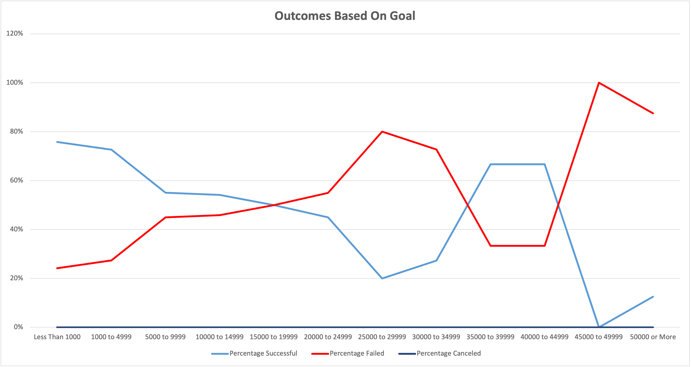

# Kickstarter Campaign Outcomes Based On Fundraising Launch Dates and Goals

## Overview of Project 

### Purpose
Louise came close to achieving her fundraising campaign goal for her new play 'Fever' in a relatively short window. To help Louise gain further insight into improving and planning for successful campaigns, an analysis was performed over other campaign fundraising outcomes as it relates to 2 key areas:

	1. The campaign launch date
	2. The funding goal for the campaign 

Louise will be able to use the following analysis as a point of reference to plan the ideal time to launch a fundraising campaign in the theater industry and to establish appropriate goals that will lead to a successful outcome and launch her next play. 

	[Link to Kickstarter data file used in this analysis] (Kickstarter_Challenge.xlsx.zip)

## Analysis and Challenges

### Analysis of Outcomes Based on Launch Date

An analysis was performed on a subset of the overall kickstarter population to include only campaigns classified under the Theater category. The counts of campaign outcomes were summarized based on the launch date, focusing solely on the month of launch (January through December). The counts were further summarized under the outcome categories: successful, failed, and canceled. Campaigns in a live outcome status were excluded from the analysis. 

A line chart was created based on this dataset as shown in the image below titled 'Theater Outcomes Based on Launch Date'. The Y-axis (vertical) shows the count of campaign outcomes and the X-axis (horizontal) shows the month of the campaign launch. Each line in the chart represents a type of outcome: Successful (blue), failed (red), and canceled (yellow). As you view the lines from left to right, you can see how the outcomes increase or decrease with each passing month in the year.

### Analysis of Outcomes Based on Goals

An analysis was performed on outcomes based on fundraising goals for campaigns falling under the Plays subcategory (a subset of Theater). Campaign outcomes (Successful, Failed, and Canceled) were summarized into one of twelve fundraising goal ranges, at the lowest range of Less Than $1,000 through the highest range of $50,000 or more. For each goal range, the total number of projects was computed by adding the number successful, failed, and canceled outcomes together. The percentage of successful, percentage of failed, and percentage of canceled outcomes was also computed at each goal range by dividing the count of the outcome by the total number of projects at that range.

A line chart was created based on this dataset as shown in the image below titled 'Outcomes Based on Goal'. The Y-axis (vertical) shows the percentage of campaign outcomes and the X-axis (horizontal) shows the 12 goal amount ranges described in the paragraph above. Each line in the chart represents a type of outcome: Successful (blue) and Failed (red). There were no canceled outcomes under the Plays subcategory so only two lines appear in this chart. As you view the lines from left to right, you can see how the % of outcomes increases or decreases as you move from the lowest goal range on the left to the highest goal range on the right.

### Challenges and Difficulties Encountered

I encountered one challenge when creating the formulas in the Outcomes Based on Goals table. To ensure I was capturing all data, I verified the counts in the table generated by formulas against the actual data on the Kickstarter tab. My counts were off by 1 so to identify the source of my variance I narrowed down the variance to a specific outcome and goal range. The criteria I entered in the COUNTIFS formula for failed outcomes in the 1000 to 4999 goal range was off by 1. After analyzing each piece of the formula, I determined I entered a criteria of <4999 which excluded one campaign with that exact goal. After updating the criteria to <5,000, the computed population matched the source population. It is good practice to have checks in place to ensure the data your analyzing is complete.    

## Results

- What are two conclusions you can draw about the Outcomes based on Launch Date?

	1. May appears to be the peak time to launch a theater fundraising campaign.
	2. December appears to be the least favorable time to launch a theater fundraising campaign.

- What can you conclude about the Outcomes based on Goals?

When a fundraising goal reaches 45,000 or above, there is a significant decline in chance for a successful outcome. This is a relevant piece of data to consider as goals are established. 

- What are some limitations of this dataset?

The outcomes based on launch date was summarized to show only the month of launch. If an extreme outlier occurred in a particular year, this might skew the analysis in the summarized format and be unrepresentative of the general population. Analysis at different views may be beneficial to see if the line chart continues to follow a similar pattern. Utilizing measures of central tendency on the dataset would also be helpful in understanding the data distribution. 

- What are some other possible tables and/or graphs that we could create?

1. Additional charts such as bar charts, pie charts, and scatter plots show the data in different layouts and may provide more clarity on trends in campaign outcomes. 

2. Filtering the data on additional fields that align more closely with Fever's campaign can provide a more useful analysis for decision making (i.e filtering on US for country of origin).

3. Creating tables and charts using measures of central tendency on the data (i.e mean, median, mode) and measures of spread (i.e range, variance, standard deviation, quartiles) will provide a deeper understanding of the underlying data and what is driving campaign outcomes. Slicing and analyzing the data in separate categories (i.e successful vs. failed, goal vs. pledged) can also reveal hidden themes and provide a more useful tool for planning a successful fundraising campaign. 
